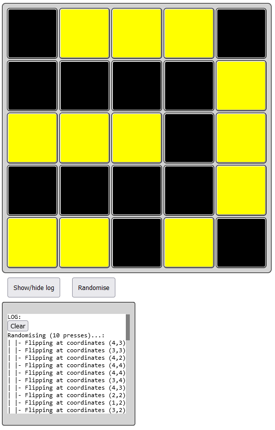

# Lights Out

Minigame.

## Demo

Try it [here](https://eyla-mckay.github.io/Lights-Out/).

## About

- Initialise a random light pattern with a button press.
- Press one of the square buttons to toggle the lights on the four adjacent buttons.
- Check the inbuilt console to track changes.
